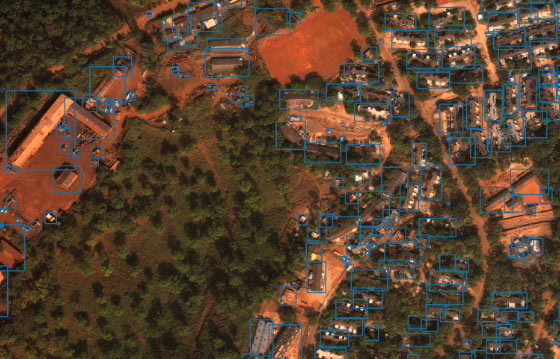

## 简介
xView is one of the largest publicly available datasets of overhead imagery. It contains images from complex scenes around the world, annotated using bounding boxes.
<div align='center'>
  
</div>

## 安装

请参考 [官方文档](https://mmdetection.readthedocs.io/en/v2.21.0/get_started.html)

## 训练

```python
python ./tools/train.py <config_file>
```
例如：
```python
python ./tools/train.py cfgs/faster_global.py
```

## 测试
```python
python ./ap_and_result/coco_eval.py <work_dir>
```

例如：
```python
python ./ap_and_result/coco_eval.py ./work_dirs/faster_global
```

## 数据集

[xView](http://xviewdataset.org/)
